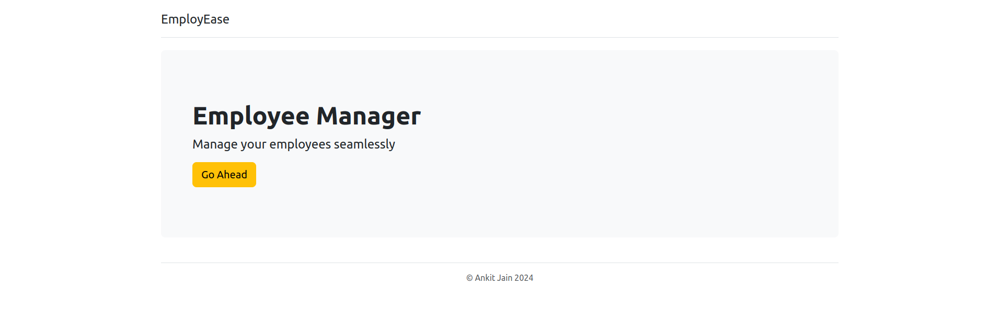
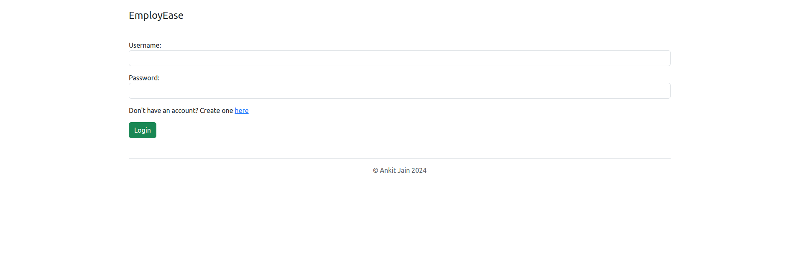
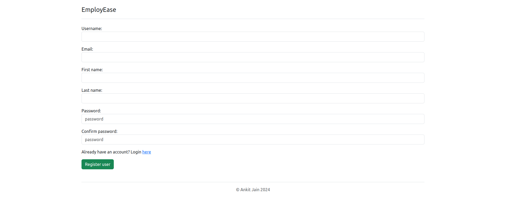
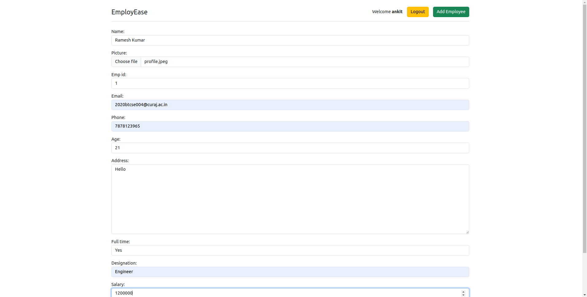
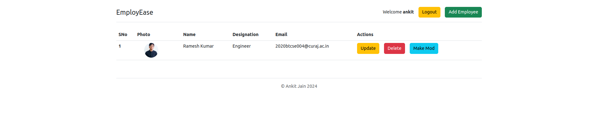
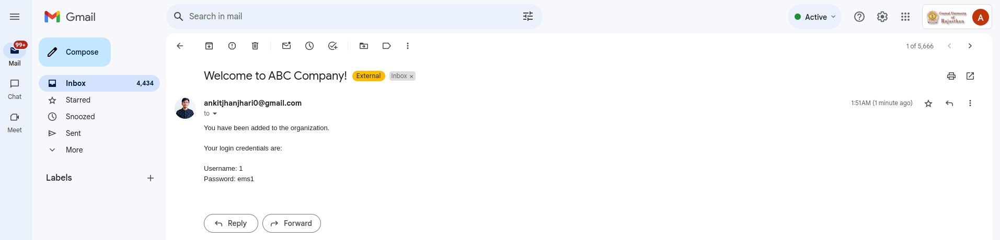
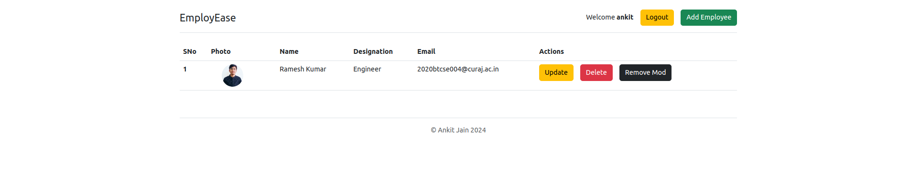
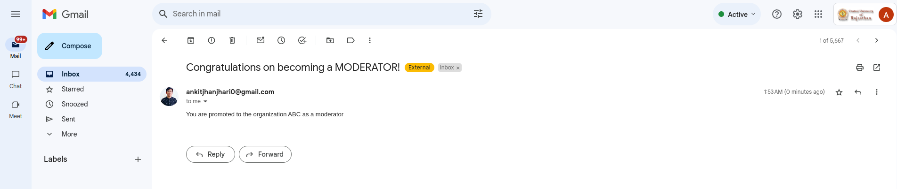
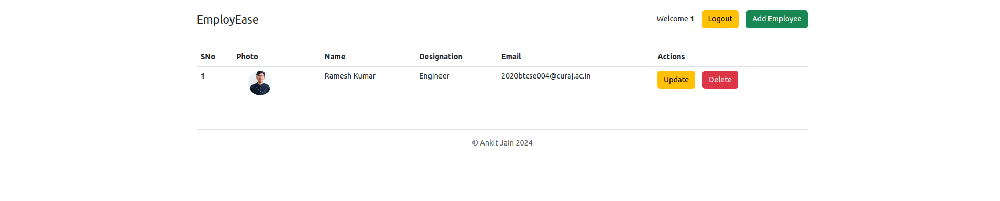
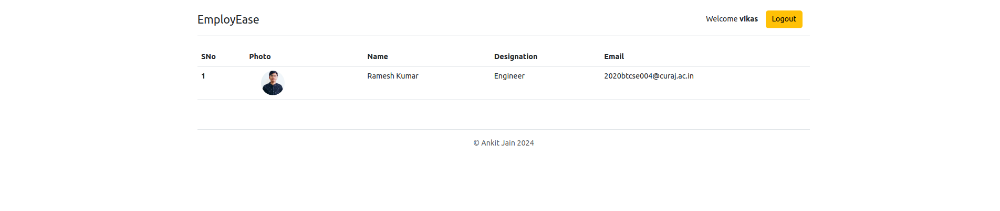

# EmployEase EMS (Employee Management System) in Django

EmployEase EMS is a web-based Employee Management System developed using Django and Python.

## Features

- **CRUD Operations:** EmployEase allows users to perform CRUD (Create, Read, Update, Delete) operations on employee records.
- **Login System:** Users can log in securely using their username and password.
- **Slug Generation:** EmployEase generates slugs for employee records to ensure unique and user-friendly URLs.
- **Registration:** New employees are registered into the system by the admin. Upon registration, each employee is assigned a unique username and password, which is sent to their email for login.
- **Admin Privileges:** The admin has the power to add, change, and delete employees from the system.
- **Moderator Permissions:** The admin can assign moderator roles to users, granting them permissions to add, delete, and update employees. Users are notified via email when they are assigned or removed from the moderator group.
- **Automatic Account Deletion:** When an employee is removed from the system by the admin, their account is automatically deleted, and their entry is removed from the database. A removal notification email is sent to the affected employee.

## Installation

1. Clone the repository: `git clone https://github.com/AnkitJain78/EmployEase.git`
2. Navigate to the project directory: `cd EmployEase`
3. Install dependencies: `pip install -r requirements.txt`
4. Make migrations: `python manage.py makemigrations`
5. Run migrations: `python manage.py migrate`
6. Start the server: `python manage.py runserver`

## Usage

1. Access the web application in your browser by navigating to `http://localhost:8000`.
2. Log in using your assigned username and password.
3. Perform CRUD operations on employee records.
4. Admins can assign moderator roles and permissions to users.
5. Enjoy the Employee Management System!

## Screenshots

## License

This project is licensed under the [MIT License](LICENSE).
